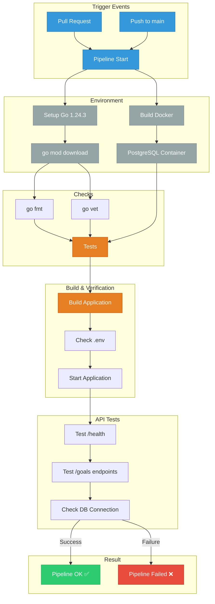

```mermaid
graph TD
  subgraph "Trigger Events"
    PR[Pull Request] --> INIT
    PUSH[Push to main] --> INIT
    INIT[Pipeline Start]
  end

  subgraph "Environment"
    INIT --> GO[Setup Go 1.24.3]
    INIT --> DOCKER[Build Docker]
    DOCKER --> PG[PostgreSQL Container]
    GO --> DEPS[go mod download]
  end

  subgraph "Checks"
    DEPS --> FMT[go fmt]
    DEPS --> VET[go vet]
    FMT --> TEST[Tests]
    VET --> TEST
    PG --> TEST
  end

  subgraph "Build & Verification"
    TEST --> BUILD[Build Application]
    BUILD --> ENV[Check .env]
    ENV --> START[Start Application]
  end

  subgraph "API Tests"
    START --> HEALTH[Test /health]
    HEALTH --> GOALS[Test /goals endpoints]
    GOALS --> DB[Check DB Connection]
  end

  subgraph "Result"
    DB -->|Success| SUCCESS[Pipeline OK ✅]
    DB -->|Failure| FAIL[Pipeline Failed ❌]
  end

  %% Styling
  classDef trigger fill:#3498db,stroke:#2980b9,color:white
  classDef env fill:#95a5a6,stroke:#7f8c8d,color:white
  classDef check fill:#e67e22,stroke:#d35400,color:white
  classDef success fill:#2ecc71,stroke:#27ae60,color:white
  classDef failure fill:#e74c3c,stroke:#c0392b,color:white

  class PR,PUSH,INIT trigger
  class GO,DOCKER,PG,DEPS env
  class TEST,BUILD check
  class SUCCESS success
  class FAIL failure

```
